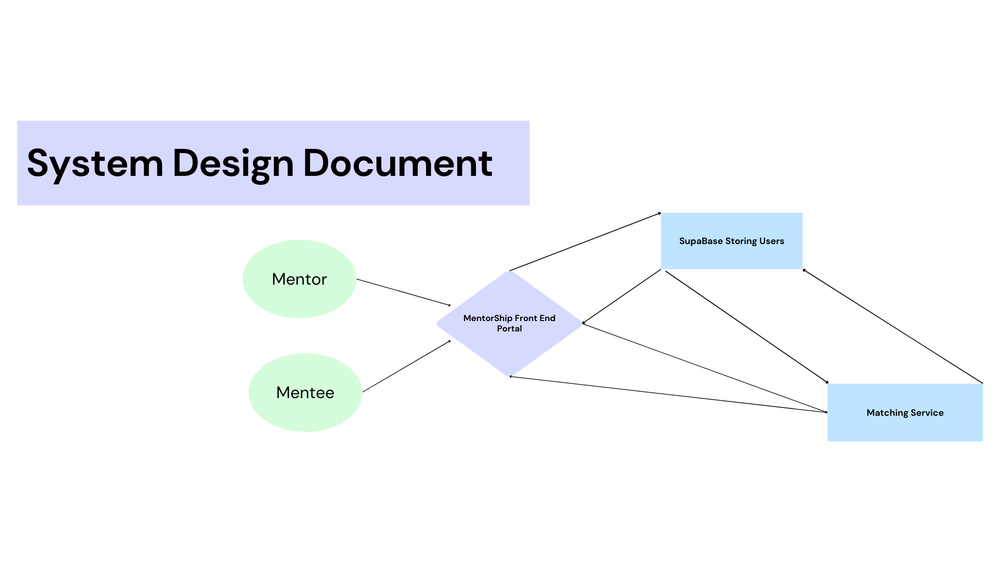

#PSA Code Sprint Hackathon 2024
## About 📘
**MentorShip** is a in-house mentor-matching portal that leverages the power of AI, algorithms, and database to automate mentor-mentee pairings. 

### 1. MatchMe 🤖 [Matching]
A dynamic matching service that processes user data in real time and matches mentees to mentors using smart algorithms to ensure optimal matching based on interests, skillsets, personalities and more!

- **External Demo** | **Internal Demo**  
---

## Architecture Diagram

---

## Team Members 👥
- **Tan Kwang Thiag**
- **Yoon Sang Won**
- **Gao Tian Run**
- **Ho Hong Wei**

---

## Tech Stack
- **Frontend**: React.js
- **Backend**: Node.js, Express.js
- **AI & Data**: Firebase API
- **UI Framework**: CSS
 
---

## How to Run the Project Locally

